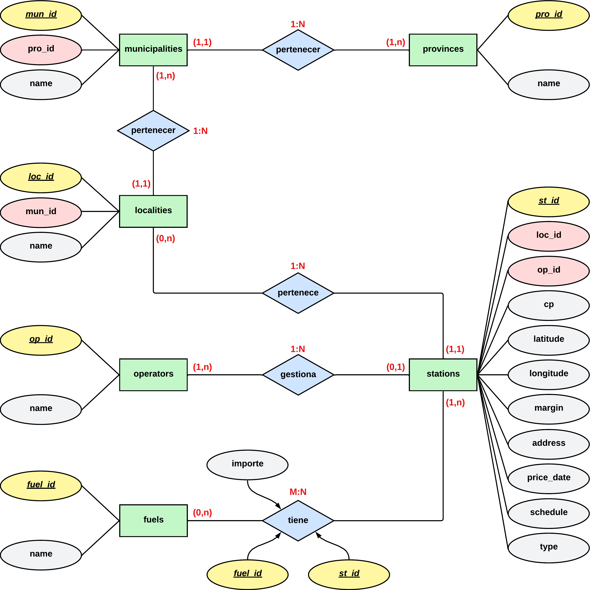

# Diseño de una base de datos relacional

## Introducción

La gestión de bases de datos en SQL es un componente fundamental en el ámbito de la Ingeniería Informática. En este trabajo, se aborda el diseño y la implementación de un sistema de bases de datos utilizando el enfoque del diagrama Entidad-Relación y su transformación en tablas relacionales. Además, se realizará la recuperación de información mediante archivos de texto plano, en este caso CSV. El objetivo principal será aplicar los conocimientos adquiridos en esta área mediante el diseño de una base de datos relacional, a partir de los datos de precios de combustibles en las diferentes comunidades autónomas de España y su posterior recuperación a nuestra base de datos.

El proceso se ha llevado a cabo siguiendo un orden estructurado. En primer lugar, se descargaron los datos con los que se trabajarían, para después realizar una limpieza de estos y exportarlos en un formato de texto plano, en nuestro caso CSV.

Posteriormente, se realizó el diseñó el diagrama Entidad-Relación, que permitió representar las entidades, atributos y relaciones presentes del dominio de la base de datos. Se ha puesto especial énfasis en comprender y aplicar las cardinalidades, tanto para establecer las relaciones fuertes como para identificar las relaciones débiles.

A continuación, se procedió a la transformación del diagrama Entidad-Relación en un modelo relacional mediante un script SQL. Este proceso implica la creación de tablas que reflejen adecuadamente la estructura y las restricciones de la base de datos, garantizando la integridad y consistencia de los datos.

Posteriormente, se implementó el código de JDBC para la inserción de los datos correspondientes a la base de datos. Esta fase fue crucial para poblar la base de datos y permitir la realización de consultas y análisis posteriores.

Finalmente, se llevaron a cabo diversas consultas sobre la base de datos, lo que permitió aplicar y evaluar la funcionalidad del modelo diseñado. Cada relación presente en el diagrama Entidad-Relación fue acompañada de una descripción breve de la técnica utilizada, destacando su relevancia y aplicabilidad en el contexto del proyecto.

Para poder interactuar con la WEB creada se puede visitar el siguiente enlace:
- [WEB JavaScript y AJAX](https://jmpinillos.github.io/dar_a2/index.html)

También se puede visitar el repositorio completo el cual contiene todos los detalles:

- [GitHub/dar_a2]([JMPinillos/Relarional-Database-Design (github.com)](https://github.com/JMPinillos/Relarional-Database-Design))


## Diseño del diagrama Entidad-Relación

En este apartado especificare los pasos seguidos para la realización del diagrama Entidad-Relación.


### Captura de requisitos

Lo primero que se realizó fue un correcto análisis de los requisitos mostrados en el enunciado para diseñar una base de datos relacional para la recuperación de datos de combustibles de España.


### Diseño conceptual

En segundo lugar, se capturaron todos los elementos necesarios para representar la estructura lógica de la base de datos, mostrando las entidades, sus atributos, las relaciones entre ellas y las restricciones que rigen dichas relaciones. 


#### Entidades

- Provincias &#10132; provinces.
- Municipios &#10132; municipalities.
- Localidades &#10132; localities.
- Operadores &#10132; operators.
- Combustibles &#10132; fuels.
- Precios &#10132; prices.
- Estaciones de servicio &#10132; stations.


#### Atributos

- **provinces**:
  - *pro_id*
  - name
- **municipalities**:
  - *mun_id*
  - pro_id
  - name
- **localities**:
  - *loc_id*
  - mun_id
  - name
- **operators**:
  - *op_id*
  - name
- **fuels**:
  - *fuel_id*
  - name
- **prices**:
  - *fuel_id*
  - *st_id*
  - name
- **stations**:
  - *st_id*
  - loc_id
  - op_id
  - fuel_id
  - cp
  - latitude
  - longitude
  - margin
  - address
  - price_date
  - schedule
  - type


#### Relaciones

- Gestiona &#10132; gestiona
- Tiene &#10132; tiene
- Pertenece &#10132; pertenece.


#### Relaciones entre tablas

- municipalities &#10132; pertenece &#10132; provinces
- localities &#10132; pertenece &#10132; municipalities
- stations &#10132; pertenece &#10132; localities
- operators &#10132; gestiona &#10132; stations
- stations &#10132; tiene &#10132; fuels
- fuels &#10132; tiene &#10132; prices


#### Claves primarias y foráneas

- **provinces**:
  - Clave primaria: *pro_id*
- **municipalities**:
  - Clave primaria: *mun_id*
  - Clave foránea: pro_id
- **localities**:
  - Clave primaria: *loc_id*
  - Clave foránea: mun_id
- **operators**:
  - Clave primaria: *op_id*
- **fuels**:
  - Clave primaria: *fuel_id*
- **prices**:
  - Claves primarias: *fuel_id*, *st_id*
- **stations**:
  - Clave primaria: *st_id*
  - Claves foráneas: loc_id, op_id, fuel_id


### Diagrama Entidad-Relación





### Explicación de las relaciones

A continuación, se realizará una breve explicación de las relaciones entre las entidades descritas en el diagrama entidad-relación.


#### Relación "pertenece" entre "municipalities" y "provinces"

En esta relación, cada municipio pertenece exactamente a una provincia, y a cada provincia le pueden pertenecer varios municipios, lo que implica una relación **1:N**. 

El enlace entre estas entidades se hace a través de la clave ***pro_id***. Se generan las claves foráneas en la entidad **municipalities** que se relaciona con la clave primaria de la entidad **provinces**.

 

#### Relación "pertenece" entre "localities" y " municipalities"

En esta relación, cada localidad pertenece exactamente a un municipio, y a cada municipio le pueden pertenecer varias localidades, lo que implica una relación **1:N**. 

El enlace entre estas entidades se hace a través de la clave ***mun_id***. Se generan las claves foráneas en la entidad **localities** que se relaciona con la clave primaria de la entidad **municipalities**.

 

#### Relación "gestiona" entre "operators" y " stations"

En esta relación, cada operadora puede gestionar varias estaciones de servicio, y cada estación de servicio es dirigida por un único operador, lo que implica una relación **1:N**. 

El enlace entre estas entidades se hace a través de la clave ***op_id***. Se generan las claves foráneas en la entidad **stations** que se relaciona con la clave primaria de la entidad **operators**.

 

#### Relación "tiene" entre "stations" y " fuels"

En esta relación, cada estación de servicio puede tener varios carburantes, y cada carburante puede pertenecer a varias estaciones de servicio, lo que implica una relación **M:N**.

Además, los carburantes tienen precios diferentes dependiendo de la estación que los suministre, los cuales estarían dentro de la relación “tiene”, evitando así tener duplicados en la tabla fuels. Para contemplar esto, se decide crear una tabla que represente la relación “tiene” a la que he llamado ***prices***, y que contiene el atributo precio. Además, esta tabla servirá de relación entre las entidades ***stations*** y ***fuels***.

El enlace entre estas entidades se hace a través de las claves ***st_id*** y ***fuel_id***. Se generan las claves foráneas en la tabla ***prices*** que se relaciona con la clave primaria de la entidad ***fuels*** y con la clave primaria de la entidad ***stations***.


## Diseño lógico

En este apartado muestro la transformación del diagrama entidad-relación en un esquema lógico, en el que se representa las tablas, la estructuración de datos y el modelado de restricciones disponibles.


## Consultas

1. **Nombre de la empresa con más estaciones de servicio terrestres**

   ```sql
   SELECT count(*) as total, name as empresa
   FROM operators, stations
   WHERE stations.op_id=operators.op_id and
         type = 'T'
   GROUP BY empresa
   ORDER BY total DESC
   LIMIT 1
   ```

    

2. **Nombre de la empresa con más estaciones de servicio marítimas**

   ```sql
   SELECT count(*) as total, name as empresa
   FROM operators, stations
   WHERE stations.op_id=operators.op_id and
         type = 'M'
   GROUP BY empresa
   ORDER BY total DESC
   LIMIT 1
   ```

   

3. **Localización, nombre de empresa y margen de la estación con el precio más bajo para el combustible «Gasolina 95 E5» en la Comunidad de Madrid**

   ```sql
   SELECT longitude as longitud, latitude as latitud, operators.name as empresa,  margin as margen
   FROM stations, operators, fuels, prices, localities
   WHERE operators.op_id = stations.op_id AND
         stations.loc_id = localities.loc_id AND
         stations.st_id = prices.st_id AND
         fuels.fuel_id = prices.fuel_id AND
         localities.name = 'MADRID' AND
         fuels.name = 'Gasolina 95 E5'
   ORDER BY amount ASC
   LIMIT 1
   ```

   

4. **Localización, nombre de empresa y margen de la estación con el precio más bajo para el combustible «Gasóleo A» si resido en el centro de Albacete y no quiero desplazarme más de 10 KM**

   ```sql
   SELECT stations.longitude as longitud, stations.latitude as latitud, operators.name as empresa, stations.margin as margen, amount
   FROM stations, operators, fuels, prices
   WHERE stations.st_id = operators.op_id AND
         stations.st_id = prices.st_id AND
         fuels.fuel_id = prices.fuel_id AND
         fuels.name = 'Gasoleo A' AND
         (6371 * acos(cos(radians(38.9942400)) * cos(radians(stations.latitude)) * cos(radians(stations.longitude) - radians(-1.8564300)) + sin(radians(38.9942400)) * sin(radians(stations.latitude)))) <= 10
   ORDER BY (6371 * acos(cos(radians(38.9942400)) * cos(radians(stations.latitude)) * cos(radians(stations.longitude) - radians(-1.8564300)) + sin(radians(38.9942400)) * sin(radians(stations.latitude)))) ASC
   LIMIT 1
   ```

    

5. **Provincia en la que se encuentre la estación de servicio marítima con el combustible «Gasolina 95 E5» más caro**

   ```sql
   SELECT provinces.name as nombre
   FROM stations, provinces, municipalities, localities, fuels, prices
   WHERE stations.loc_id = localities.loc_id AND
         localities.mun_id = municipalities.mun_id AND
         municipalities.pro_id = provinces.pro_id AND
         stations.st_id = prices.st_id AND
         fuels.fuel_id = prices.fuel_id AND
         fuels.name = 'Gasolina 95 E5' AND
         stations.type = 'M'
   ORDER BY amount DESC
   LIMIT 1
   ```


## Elaboración del código

El código Java proporciona una solución para importar datos desde un archivo CSV a una base de datos MySQL.

1. **Establecimiento de Conexión y Borrado de Datos Antiguos**:

   El programa comienza estableciendo una conexión a una base de datos MySQL llamada "laboratorio_EESS". Luego, borra los datos existentes en las tablas (*provinces*, *municipalities*, *localities*, *operators*, *fuels*, *stations*, *prices*) para asegurar una inserción limpia de datos actualizados.

2. **Lectura de Datos desde un Archivo CSV**:

   Se utiliza la biblioteca `opencsv` para leer un archivo CSV llamado "Precios_EESS.csv". Este archivo contiene información sobre estaciones de servicio, precios de combustibles y otros detalles relacionados.

3. **Verificación de Duplicados**:

   Para ciertos tipos de datos, como provincias, municipios, localidades, operadores y combustibles, antes de crear un nuevo objeto correspondiente, realizo un en la lista existente de objetos para verificar si ya existe un objeto con el mismo dato.

   Por ejemplo, al leer las provincias, compruebo si ya hay una provincia en la lista con el mismo nombre. Si existe, utilizo ese objeto existente; de lo contrario, creas uno nuevo y lo agrego a la lista.

   Posteriormente, cuando inserto datos en la base de datos, realizo una verificación similar utilizando consultas SQL para determinar si el elemento ya existe en la base de datos antes de insertarlo. Si ya existe, no realizas la inserción.

   Este enfoque garantiza que no haya duplicados en las listas de objetos y evita la inserción de datos duplicados en la base de datos, mejorando la integridad de los datos y reduciendo el riesgo de conflictos.

   Aunque incluyo un control de inserción de duplicados a la hora de la inserción, en mi caso podría haberla obviado, pues lo primero que realizo es el borrado completo de los datos de la base de datos.

4. **Procesamiento de Datos y Creación de Listas de Objetos**:

   El código procesa las líneas del archivo CSV y crea objetos correspondientes a las entidades del modelo de datos, como provincias (`MySqlProvinces`), municipios (`MySqlMunicipalities`), localidades (`MySqlLocalities`), operadoras (`MySqlOperators`), combustibles (`MySqlFuels`), estaciones (`MySqlStations`), y precios (`MySqlPrices`). La gestión de identificadores se realiza mediante el uso de contadores y estrategias de lotes durante la lectura y la inserción de datos.

5. **Inserción de Datos en la Base de Datos**:

   Los objetos creados se insertan en las respectivas tablas de la base de datos MySQL. Se utiliza un enfoque de inserción por lotes (*batches*) para mejorar la eficiencia de la operación, minimizando el número de operaciones de base de datos y mejorando el rendimiento.

6. ***Commit* y Cierre de Conexión**:

   Después de completar la inserción de datos, se realiza un *commit* para confirmar los cambios en la base de datos. Luego, se cierra la conexión a la base de datos de manera adecuada.

7. **Manejo de Errores**:

   El código maneja excepciones, registrando mensajes de error detallados en caso de problemas durante la ejecución. Esto garantiza una gestión robusta de errores y facilita la depuración.


## Conclusiones

El desarrollo de la actividad siguió una secuencia lógica y estructurada, comenzando con la descarga y limpieza de datos, pasando por la creación del diagrama Entidad-Relación, la transformación a un modelo relacional mediante SQL, y culminando con la implementación de código JDBC para la inserción de datos.

El diseño del diagrama Entidad-Relación resultó fundamental, destacando la importancia de comprender y aplicar las cardinalidades para establecer relaciones sólidas. La transformación efectiva de este diagrama a un modelo relacional mediante SQL aseguró la coherencia y consistencia de la estructura de la base de datos.

La implementación del código JDBC demostró eficiencia, incorporando modularidad y manejo adecuado de excepciones. Esto facilitó la inserción de datos en la base de datos.

Las consultas realizadas sobre la base de datos permitieron evaluar la funcionalidad del modelo, resaltando la aplicabilidad práctica de las relaciones definidas en el diagrama Entidad-Relación. La experiencia práctica en el proceso de ingestión de datos me ha proporcionado de habilidades en la manipulación de datos en entornos del mundo real.

La actividad integró de manera efectiva conceptos teóricos con la aplicación práctica, consolidando la comprensión de diseño de bases de datos. Además, sentó las bases para desarrollos futuros, como la expansión del modelo, la optimización de consultas y la exploración de nuevas fuentes de datos.

Todo esto en conjunto, ha sido un ejercicio completo que abarca todas las fases de trabajo con bases de datos, proporcionando una experiencia valiosa y reforzando los conocimientos adquiridos en la asignatura de manera práctica.


<center>by <strong>Jose Manuel Pinillos</strong></center>

